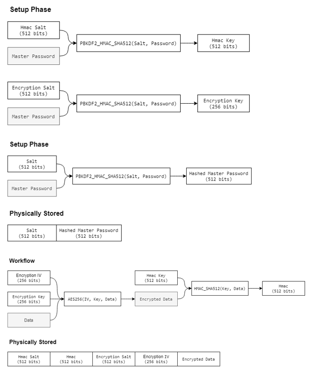

# HawkPass

This is a simple local password manager written in Java. It is a command line program that securely stores user passwords.
The password manager has 256-bit security. Therefore, any encryption will be done using 256-bit keys and hashing will be done using 512 bits.
For more information, refer to the password manager [specification](docs/Research%20Project.pdf).

# Design
- [x] Two separate keys for encryption and integrity protection.
- [x] Encryption using AES-256 in the CBC mode with PKCS5Padding.
- [x] Integrity protection using HMAC-SHA512.
- [x] Slow hashing using PBKDF2 with 65536 iterations to make brute-force attacks difficult.
- [x] Salts and IVs generated using cryptographically secure random number generators.
- [x] New IV generated after every operation to ensure that two files with the same stored passwords never have the same signature.

# Diagram


# Features
- [x] Generate a random and unpredictable password for an account
- [x] Store a domain, username, and password for an account
- [x] Retrieve a domain, username, and password for an account
- [x] Remove an account and its password
- [x] Change an account's password

# Usage
- To **run** the program, use the command ```java -jar HawkPass.jar```
- To **compile** the code, use the command ```javac HawkPass.java```
- To **run** the code, use the command ```java HawkPass```

# Prerequisites
- Java 14
